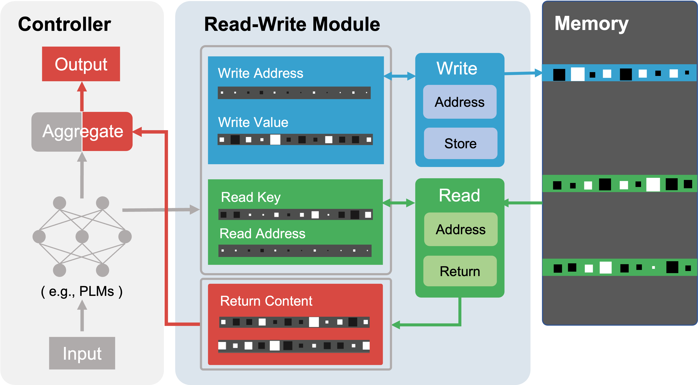

# Neural Memory Papers

A curated paper list of Neural Network with External Memory.

## Contents
  
  - [Introduction](#introduction)
    - [Keywords Convention](#keywords-convention)
  - [Surveys & Overview](#surveys--overview)
  - [Papers](#papers)
  - [Talks](#talks)
  - [Blogs](#blogs)

## Introduction

This is paper list about **neural network with external memory**. 

### Keywords Convention

-  The tasks involved in the work.
-  The key type of memory for retrieving in the work. For example, in the instance-key memory, the representation of an example in the dataset is used as an key in memory.

## Surveys & Overview

- **A Survey on Retrieval-Augmented Text Generation**. Preprint, 2022. [[pdf]](https://arxiv.org/abs/2202.01110)
  - *Huayang Li, Yixuan Su, Deng Cai, Yan Wang, Lemao Liu*
- **Artefact Retrieval: Overview of NLP Models with Knowledge Base Access**. Preprint, 2021. [[pdf]](https://arxiv.org/pdf/2201.09651.pdf)
  - *Vilém Zouhar, Marius Mosbach, Debanjali Biswas, Dietrich Klakow*
- **A Taxonomy for Neural Memory Networks**. Preprint, 2018. [[pdf]](https://arxiv.org/pdf/1805.00327.pdf)
  - *Ying Ma, Jose Principe*

## Papers

### 2022

- **Unsupervised Cross-Task Generalization via Retrieval Augmentation**. Preprint, 2022. [[pdf]](https://arxiv.org/pdf/2204.07937.pdf)
  - *Bill Yuchen Lin, Kangmin Tan, Chris Miller, Beiwen Tian, Xiang Ren*
- **Augmenting Pre-trained Language Models with QA-Memory for Open-Domain Question Answering**. Preprint, 2022. [[pdf]](https://arxiv.org/pdf/2204.04581.pdf)
  - *Wenhu Chen, Pat Verga, Michiel de Jong, John Wieting, William W. Cohen*
- **Relational Memory Augmented Language Models**. Preprint, 2022. [[pdf]](https://arxiv.org/pdf/2201.09680.pdf)
  - *Qi Liu, Dani Yogatama, Phil Blunsom*
- **Memorizing Transformers**. ICLR 2022. [[pdf]](https://arxiv.org/abs/2203.08913)
  - *Yuhuai Wu, Markus N. Rabe, DeLesley Hutchins, Christian Szegedy*
- **Improving Meta-learning for Low-resource Text Classification and Generation via Memory Imitation**. ACL 2022.    [[pdf]](https://arxiv.org/abs/2203.11670)
  - *Yingxiu Zhao, Zhiliang Tian, Huaxiu Yao, Yinhe Zheng, Dongkyu Lee, Yiping Song, Jian Sun, Nevin L. Zhang*
- **Dynamic Key-value Memory Enhanced Multi-step Graph Reasoning for Knowledge-based Visual Question Answering**. AAAI 2022. [[pdf]](https://arxiv.org/abs/2203.02985)
  - *Mingxiao Li, Marie-Francine Moens*

### 2021

- **Improving language models by retrieving from trillions of tokens**. Preprint, 2021. [[pdf]](https://arxiv.org/abs/2112.04426)
  - *Sebastian Borgeaud, Arthur Mensch, Jordan Hoffmann, Trevor Cai, Eliza Rutherford, Katie Millican, George van den Driessche, Jean-Baptiste Lespiau, Bogdan Damoc, Aidan Clark, Diego de Las Casas, Aurelia Guy, Jacob Menick, Roman Ring, Tom Hennigan, Saffron Huang, Loren Maggiore, Chris Jones, Albin Cassirer, Andy Brock, Michela Paganini, Geoffrey Irving, Oriol Vinyals, Simon Osindero, Karen Simonyan, Jack W. Rae, Erich Elsen, Laurent Sifre*
- **Adaptive Semiparametric Language Models**. TACL, 2021. [[pdf]](https://aclanthology.org/2021.tacl-1.22/)
  - *Dani Yogatama, Cyprien de Masson d’Autume, Lingpeng Kong*
- **Memory-Augmented Relation Network for Few-Shot Learning**. MM 2020. [[pdf]](https://dl.acm.org/doi/pdf/10.1145/3394171.3413811)
  - *Jun He, Richang Hong, Xueliang Liu, Mingliang Xu, Zheng-Jun Zha, Meng Wang*
- **GNN-LM: Language Modeling based on Global Contexts via GNN**. ICLR 2022. [[pdf]](https://arxiv.org/abs/2110.08743)
  - *Yuxian Meng, Shi Zong, Xiaoya Li, Xiaofei Sun, Tianwei Zhang, Fei Wu, Jiwei Li*
- **Efficient Nearest Neighbor Language Models**. EMNLP 2021.  [[pdf]](https://arxiv.org/abs/2109.04212)
  - *Junxian He, Graham Neubig, Taylor Berg-Kirkpatrick*
- **KNN-BERT: Fine-Tuning Pre-Trained Models with KNN Classifier**. Preprint, 2021. [[pdf]](https://arxiv.org/pdf/2110.02523.pdf)
  - *Linyang Li, Demin Song, Ruotian Ma, Xipeng Qiu, Xuanjing Huang*
- **Rethinking Nearest Neighbors for Visual Classification**. Preprint, 2021. [[pdf]](https://arxiv.org/pdf/2112.08459.pdf)
  - *Menglin Jia, Bor-Chun Chen, Zuxuan Wu, Claire Cardie, Serge Belongie, Ser-Nam Lim*
- **Augmenting Transformers with KNN-Based Composite Memory for Dialog**. TACL, 2021. [[pdf]](https://direct.mit.edu/tacl/article/doi/10.1162/tacl_a_00356/97779/Augmenting-Transformers-with-KNN-Based-Composite)
  - *Angela Fan, Claire Gardent, Chloé Braud, Antoine Bordes*
- **GraphMemDialog: Optimizing End-to-End Task-Oriented Dialog Systems Using Graph Memory Networks**. AAAI 2022. [[pdf]](https://www.aaai.org/AAAI22Papers/AAAI-7257.WuJ.pdf)
  - Jie WuIan G. Harris, Hongzhi Zhao*
- **Memory-based Jitter: Improving Visual Recognition on Long-tailed Data with Diversity In Memory**. AAAI 2022. [[pdf]](https://www.aaai.org/AAAI22Papers/AAAI-521.LiuJ.pdf)
  - *Jialun Liu, Wenhui Li, Yifan Sun*

### 2020

- **Learning Reasoning Strategies in End-to-End Differentiable Proving**. ICML 2020. [[pdf]](http://proceedings.mlr.press/v119/minervini20a/minervini20a.pdf)
  - *Pasquale Minervini, Sebastian Riedel, Pontus Stenetorp, Edward Grefenstette, Tim Rocktäschel*
- **Meta-Learning with Dynamic-Memory-Based Prototypical Network for Few-Shot Event Detection**. WSDM 2020. [[pdf]](https://dl.acm.org/doi/abs/10.1145/3336191.3371796)
  - *Shumin Deng, Ningyu Zhang, Jiaojian Kang, Yichi Zhang, Wei Zhang, Huajun Chen*
- **Meta-Learning Deep Energy-Based Memory Models**. ICLR 2020. [[pdf]](https://arxiv.org/abs/1910.02720)
  - *Sergey Bartunov, Jack Rae, Simon Osindero, Timothy Lillicrap*
- **Dynamic Memory Induction Networks for Few-Shot Text Classification**. ACL 2020. [[pdf]](https://aclanthology.org/2020.acl-main.102/)
  - *Ruiying Geng, Binhua Li, Yongbin Li, Jian Sun, Xiaodan Zhu*
- **Meta-Neighborhoods**. NeurIPS 2020. [[pdf]](https://proceedings.neurips.cc/paper/2020/hash/35464c848f410e55a13bb9d78e7fddd0-Abstract.html)
  - *Siyuan Shan, Yang Li, Junier B. Oliva*
- **Multigrid Neural Memory**. ICML 2020. [[pdf]](http://proceedings.mlr.press/v119/huynh20a/huynh20a.pdf)
  - *Tri Huynh, Michael Maire, Matthew R. Walter*
- **REALM: Retrieval-Augmented Language Model Pre-Training**. Preprint, 2020. [[pdf]](https://arxiv.org/pdf/2002.08909.pdf)
  - *Kelvin Guu, Kenton Lee, Zora Tung, Panupong Pasupat, Ming-Wei Chang*
- **MEMO: A Deep Network for Flexible Combination of Episodic Memories**. ICLR 2020. [[pdf]](https://arxiv.org/abs/2001.10913)
  - *Andrea Banino, Adrià Puigdomènech Badia, Raphael Köster, Martin J. Chadwick, Vinicius Zambaldi, Demis Hassabis, Caswell Barry, Matthew Botvinick, Dharshan Kumaran, Charles Blundell*
- **Self-Attentive Associative Memory**. ICML 2020. [[pdf]](https://arxiv.org/pdf/2002.03519.pdf)
  - *Hung Le, Truyen Tran, Svetha Venkatesh*
- **Efficient Meta Lifelong-Learning with Limited Memory**. EMNLP 2020. [[pdf]](https://aclanthology.org/2020.emnlp-main.39.pdf)
  - *Zirui Wang, Sanket Vaibhav Mehta, Barnabás Póczos, Jaime Carbonell*

### 2019

- **Non-Parametric Adaptation for Neural Machine Translation**. NAACL 2019. [[pdf]](https://aclanthology.org/N19-1191.pdf)
  - *Ankur Bapna, Orhan Firat*
- **Metalearned Neural Memory**. NeurIPS 2019. [[pdf]](https://proceedings.neurips.cc/paper/2019/file/182bd81ea25270b7d1c2fe8353d17fe6-Paper.pdf)
  - *Tsendsuren Munkhdalai, Alessandro Sordoni, Tong Wang, Adam Trischler*
- **Learning to Remember More with Less Memorization**. ICLR 2019. [[pdf]](https://arxiv.org/pdf/1901.01347.pdf)
  - *Hung Le, Truyen Tran, Svetha Venkatesh*
- **Contextual Memory Trees**. ICML 2019. [[pdf]](http://proceedings.mlr.press/v97/sun19a/sun19a.pdf)
  - *Wen Sun, Alina Beygelzimer, Hal Daumé Iii, John Langford, Paul Mineiro*
- **Generalization through Memorization: Nearest Neighbor Language Models**. ICLR 2020. [[pdf]](https://arxiv.org/abs/1911.00172)
  - *Urvashi Khandelwal, Omer Levy, Dan Jurafsky, Luke Zettlemoyer, Mike Lewis*
- **Meta-Learning Neural Bloom Filter**. ICML 2019. [[pdf]](http://proceedings.mlr.press/v97/rae19a/rae19a.pdf)
  - *Jack Rae, Sergey Bartunov, Timothy Lillicrap*
- **Adaptive Posterior Learning: few-shot learning with a surprise-based memory module**. ICLR 2019. [[pdf]](https://arxiv.org/abs/1902.02527)
  - *Tiago Ramalho, Marta Garnelo*
- **Episodic Memory in Lifelong Language Learning**. NeurIPS 2019. [[pdf]](https://arxiv.org/pdf/1906.01076.pdf)
  - *Cyprien de Masson d'Autume, Sebastian Ruder, Lingpeng Kong, Dani Yogatama*
- **A Working Memory Model for Task-oriented Dialog Response Generation**. ACL 2018. [[pdf]](https://aclanthology.org/P19-1258.pdf)
  - *Xiuyi Chen, Jiaming Xu, Bo Xu*
- **Enhancing Key-Value Memory Neural Networks for Knowledge Based Question Answering**. NAACL 2019. [[pdf]](https://aclanthology.org/N19-1301/)
  - *Kun Xu, Yuxuan Lai, Yansong Feng, Zhiguo Wang*
  
### 2018

- **Memory-based Parameter Adaptation**. ICLR 2018. [[pdf]](https://arxiv.org/pdf/1802.10542.pdf)
  - *Pablo Sprechmann, Siddhant M. Jayakumar, Jack W. Rae, Alexander Pritzel, Adrià Puigdomènech Badia, Benigno Uria, Oriol Vinyals, Demis Hassabis, Razvan Pascanu, Charles Blundell*
- **Visual Question Answering with Memory-Augmented Networks**. CVPR 2018. [[pdf]](https://openaccess.thecvf.com/content_cvpr_2018/html/Ma_Visual_Question_Answering_CVPR_2018_paper.html)
  - *Chao Ma, Chunhua Shen, Anthony Dick, Qi Wu, Peng Wang, Anton van den Hengel, Ian Reid*
- **Heterogeneous Memory Enhanced Multimodal Attention Model for Video Question Answering**. CVPR 2018. [[pdf]](https://openaccess.thecvf.com/content_CVPR_2019/html/Fan_Heterogeneous_Memory_Enhanced_Multimodal_Attention_Model_for_Video_Question_Answering_CVPR_2019_paper.html)
  - *Chenyou Fan, Xiaofan Zhang, Shu Zhang, Wensheng Wang, Chi Zhang, Heng Huang*
- **Semi-Supervised Deep Learning with Memory**. ECCV 2018. [[pdf]](https://openaccess.thecvf.com/content_ECCV_2018/html/Yanbei_Chen_Semi-Supervised_Deep_Learning_ECCV_2018_paper.html)
  - *Yanbei Chen, Xiatian Zhu, Shaogang Gong*
- **Fast Parametric Learning with Activation Memorization**. ICML 2018. [[pdf]](http://proceedings.mlr.press/v80/rae18a/rae18a.pdf)
  - *Jack Rae, Chris Dyer, Peter Dayan, Timothy Lillicrap*
- **Memory, Show the Way: Memory Based Few Shot Word Representation Learning**. EMNLP 2018. [[pdf]](https://aclanthology.org/D18-1173.pdf)
  - *Jingyuan Sun, Shaonan Wang, Chengqing Zong*
- **Working Memory Networks: Augmenting Memory Networks with a Relational Reasoning Module**. ACL 2018. [[pdf]](https://aclanthology.org/P18-1092.pdf)
  - *Juan Pavez, Héctor Allende, Héctor Allende-Cid*
- **Memory Matching Networks for One-Shot Image Recognition**. CVPR 2018. [[pdf]](https://openaccess.thecvf.com/content_cvpr_2018/papers/Cai_Memory_Matching_Networks_CVPR_2018_paper.pdf)
  - *Qi Cai, Yingwei Pan, Ting Yao, Chenggang Yan, Tao Mei*
- **Mem2Seq: Effectively Incorporating Knowledge Bases into End-to-End Task-Oriented Dialog Systems**. ACL 2018. [[pdf]](https://aclanthology.org/P18-1136.pdf)
  - *Andrea Madotto, Chien-Sheng Wu, Pascale Fung*

### 2017

- **Memory Augmented Neural Networks with Wormhole Connections**. Preprint, 2017. [[pdf]](https://arxiv.org/pdf/1701.08718.pdf)
  - *Caglar Gulcehre, Sarath Chandar, Yoshua Bengio*
- **Dynamic Neural Turing Machine with Continuous and Discrete Addressing Schemes**. Neural Computation, 2018. [[pdf]](https://arxiv.org/abs/1607.00036)
  - *Caglar Gulcehre, Sarath Chandar, Kyunghyun Cho, Yoshua Bengio*
- **Improving Neural Language Models with a Continuous Cache**. ICLR 2017. [[pdf]](https://arxiv.org/abs/1612.04426)
  - *Edouard Grave, Armand Joulin, Nicolas Usunier*
- **Large Memory Layers with Product Keys**. NeurIPS 2017. [[pdf]](https://proceedings.neurips.cc/paper/2019/file/9d8df73a3cfbf3c5b47bc9b50f214aff-Paper.pdf)
  - *Guillaume Lample, Alexandre Sablayrolles, Marc'Aurelio Ranzato, Ludovic Denoyer, Herve Jegou*
- **Learning to Remember Rare Events**. ICLR 2017. [[pdf]](https://arxiv.org/abs/1703.03129)
  - *Łukasz Kaiser, Ofir Nachum, Aurko Roy, Samy Bengio*
- **Meta Networks**. ICML 2019. [[pdf]](https://arxiv.org/pdf/1703.00837.pdf)
  - *Tsendsuren Munkhdalai, Hong Yu*
- **Learning End-to-End Goal-Oriented Dialog**. ICLR 2017. [[pdf]](https://arxiv.org/abs/1605.07683)
  - *Antoine Bordes, Y-Lan Boureau, Jason Weston*

### 2016

- **Meta-Learning with Memory-Augmented Neural Networks**. ICML 2016.   [[pdf]](https://proceedings.mlr.press/v48/santoro16.pdf)
  - *Adam Santoro, Sergey Bartunov, Matthew Botvinick, Daan Wierstra, Timothy Lillicrap*
- **Hybrid computing using a neural network with dynamic external memory**. Nature, 2016. [[pdf]](https://www.nature.com/articles/nature20101?ref=https://githubhelp.com)
  - *Alex Graves, Greg Wayne, Malcolm Reynolds, Tim Harley, Ivo Danihelka, Agnieszka Grabska-Barwińska, Sergio Gómez Colmenarejo, Edward Grefenstette, Tiago Ramalho, John Agapiou, Adrià Puigdomènech Badia, Karl Moritz Hermann, Yori Zwols, Georg Ostrovski, Adam Cain, Helen King, Christopher Summerfield, Phil Blunsom1, Koray Kavukcuoglu, Demis Hassabis*
- **Scaling Memory-Augmented Neural Networks with Sparse Reads and Writes**. NeurIPS 2016.  [[pdf]](https://proceedings.neurips.cc/paper/2016/file/3fab5890d8113d0b5a4178201dc842ad-Paper.pdf)
  - *Jack Rae, Jonathan J. Hunt, Ivo Danihelka, Timothy Harley, Andrew W. Senior, Gregory Wayne, Alex Graves, Timothy Lillicrap*
- **Key-Value Memory Networks for Directly Reading Documents**. EMNLP 2016. [[pdf]](https://arxiv.org/abs/1606.03126)
  - *Alexander Miller, Adam Fisch, Jesse Dodge, Amir-Hossein Karimi, Antoine Bordes, Jason Weston*

### 2015

- **End-To-End Memory Networks**. NeurIPS 2015. [[pdf]](https://arxiv.org/pdf/1503.08895.pdf)
  - *Sainbayar Sukhbaatar, Arthur Szlam, Jason Weston, Rob Fergus*

### 2014

- **Memory Networks**. ICLR 2015.   [[pdf]](https://arxiv.org/pdf/1410.3916.pdf)
  - *Jason Weston, Sumit Chopra, Antoine Bordes*
- **Neural Turing Machines**, Preprint, 2014.  [[pdf]](https://arxiv.org/abs/1410.5401) 
  - *Alex Graves, Greg Wayne, Ivo Danihelka* 

## Talks

- Wenhu Chen, **Building Semi-Parametric Language Models to Integrate World Knowledge**. March, 2022. [[video]](https://www.bilibili.com/video/BV1dr4y1W7E9?p=2)

## Blogs
